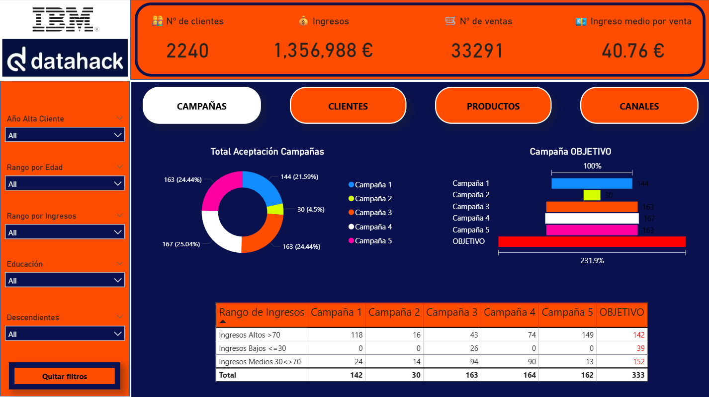
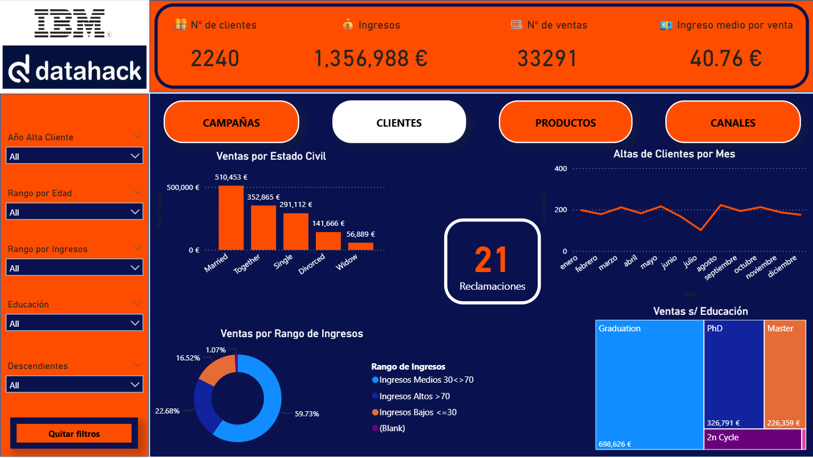
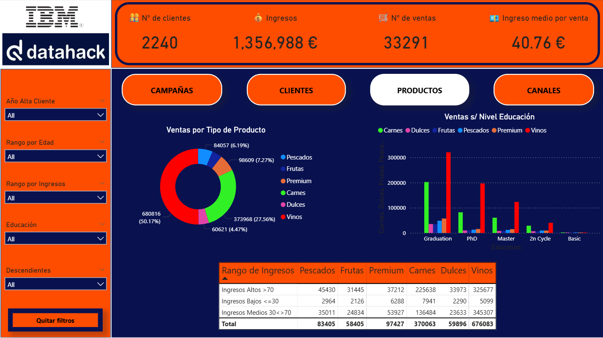
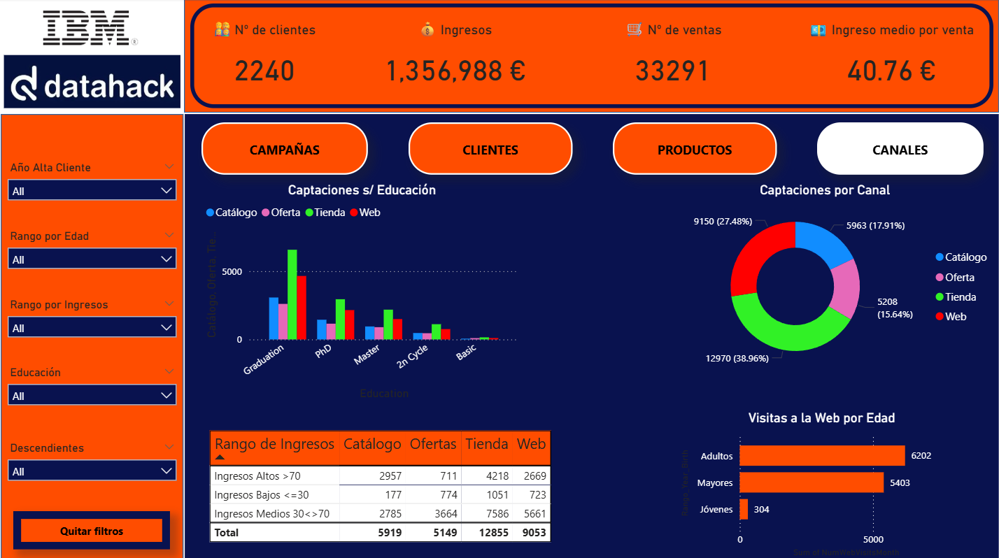

# Dashboard Análisis de Clientes y Ventas - Proyecto Final

Dashboard desarrollado como proyecto final del bootcamp de Data Analytics de Datahack (IBM).
Analiza el comportamiento de 2.240 clientes con 1.356.988 € en ingresos totales y 33.291 ventas registradas.

## Dataset
Fuente: Marketing Campaign Dataset (Kaggle)
Formato: CSV con 2.240 registros y 29 variables.
Incluye datos demográficos, historial de compras por categoría de producto,
respuesta a campañas de marketing y canales de venta.
Dataset público disponible en: https://www.kaggle.com/datasets/imakash3011/customer-personality-analysis

## Herramientas
- Power BI Desktop
- Power Query para limpieza y modelado de datos
- DAX para métricas y KPIs calculados

## Páginas del dashboard

**Campañas:** aceptación de 5 campañas de marketing segmentada por rango de ingresos.
El total acumulado supera el 231% del objetivo.

**Clientes:** ventas por estado civil, altas de clientes por mes, distribución por rango de ingresos
y ventas según nivel educativo. Incluye contador de reclamaciones.

**Productos:** distribución de ventas por categoría (Vinos representa el 50,17% del total,
Carnes el 27,56%). Cruce de ventas por producto y nivel educativo del cliente.

**Canales:** captaciones por canal según nivel educativo, distribución por canal de venta
(Tienda lidera con 38,96%) y visitas web segmentadas por edad.

## Filtros globales
Todos los filtros aplican a las 4 páginas simultáneamente:
año de alta, rango de edad, rango de ingresos, nivel educativo y número de descendientes.

## Capturas

